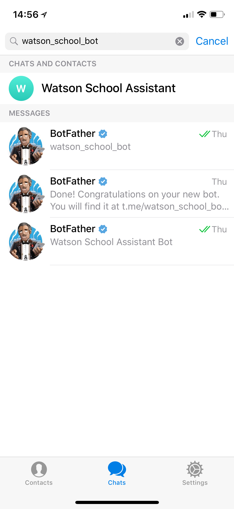
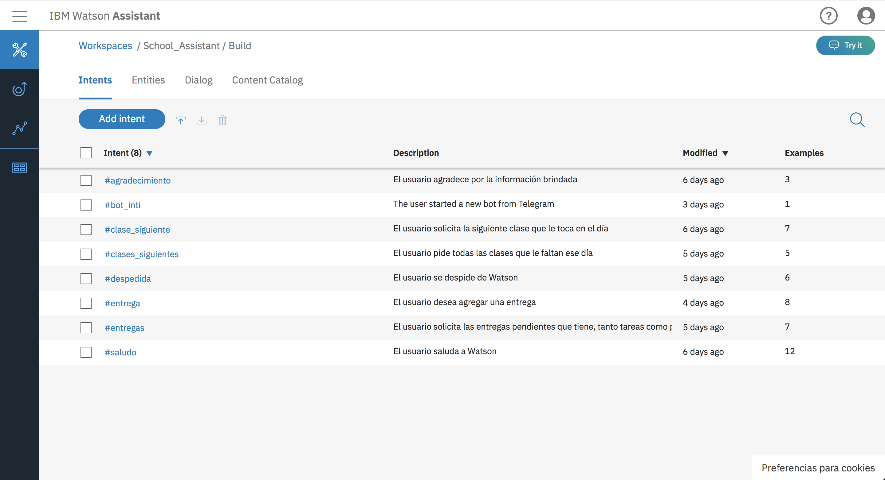
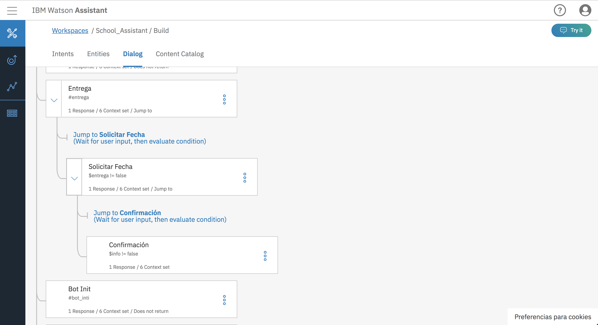

# Watson School Assistant
Proyecto para IBM Ambassadors

Manuel Alejandro Mendoza Domínguez

Watson School Assistant es un bot que utiliza diferentes herramientas que ofrece la nube de IBM para
facilitarle a los estudiantes ciertas tareas cotidianas.

[Aquí](https://school-smart-assistant.mybluemix.net)se puede acceder al servició o se puede buscar 
como bot en telegram.

Watson School Assistant utiliza los siguientes serviciós de la nube de IBM para funcionar correctamente:
1. Watson Assistant
2. Servidor con tecnología Node JS alojado con Cloud Foundry
3. Servidor con tecnología Node-Red alojado con Cloud Foundry

## Watson Assistant

Se utiliza la tecnología de Watson Assistant para poder entender correctamente lo que le esta solicitando 
el usuario al bot.

Para poder hacer esto se ha entrenado un modelo para reaccionar correctamente a diferentes '#intents' y responder 
de manera correcta al usuario siguiendo un 'dialog' con diferentes respuestas.

## Servidor Node JS

Se desarrollo un servidor con Node JS para poder brindar el servicio en la WEB (como se puede ver
[aquí](https://school-smart-assistant.mybluemix.net)), así como para almacenar la información del usuario (clases y
 tareas pendientes) y responder con información correcta y actualizada a las solicitudes del usuario.
 
 > El codigo de este servidor se encuentra en 'app.js'
 

## Servidor Node-Red

Se utilizo Node-Red para poder hacer la conexión del bot con Telegram y permitirle
a los usuarios utilizar a Watson School Assistant desde su celular de una manera más 
cómoda y sencilla.

Al hacer la conexión con Telegram también se pueden enviar notificaciones al usuario, 
actualmente se utilizan para mandarle un mensaje a las '7:40 am' con los pendientes
que tiene.